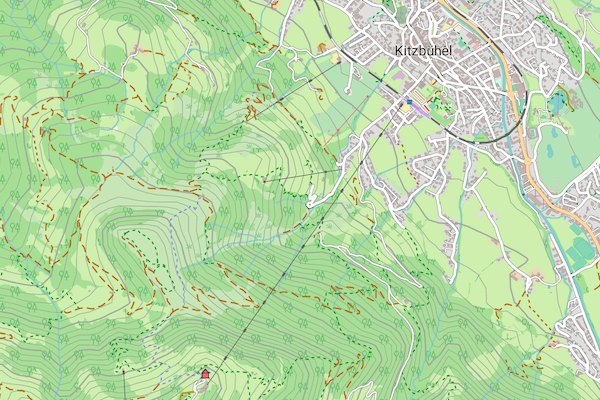

# Entwicklungsumgebung für die Freizeitkarten-Android



## 👋 Willkommen beim Projekt

Schön, dass du Interesse an dieser doch sehr umfangreichen Entwicklungsumgebung für Karten hast. Wir freuen uns über jeden Beitrag und jede Interaktion aus der Community.

Aufgrund der Komplexität des Projektes ist es für uns wichtig, Anfragen effizient zu kanalisieren. Um den Überblick zu behalten und dir so schnell wie möglich helfen zu können, bitten wir dich, die folgenden Richtlinien zu beachten:

### 🐞 Fehler gefunden? -> Erstelle ein "Issue"

Wenn du auf einen Fehler, einen Absturz oder ein unerwartetes Verhalten stößt, erstelle bitte ein **[Issue](https://github.com/freizeitkarte/fzk-mde-android/issues/new/choose)**.

Ein gutes Fehler-Ticket enthält idealerweise:
*   Eine klare und aussagekräftige Überschrift.
*   Schritte, um den Fehler zu reproduzieren.
*   Was du erwartet hast und was stattdessen passiert ist.
*   Informationen zu deiner Umgebung (z.B. Betriebssystem, Version).

### ❓ Fragen zur Nutzung? -> Starte eine "Diskussion"

Für allgemeine Fragen zur Anwendung, zur Konfiguration, für "Wie mache ich ...?"-Szenarien oder auch für Ideenaustausch nutze bitte die **[Discussions](https://github.com/freizeitkarte/fzk-mde-android/discussions)**.

Dies hat für alle den Vorteil, dass:
*   Fragen und Antworten für die gesamte Community sichtbar und durchsuchbar bleiben.
*   Andere Nutzer ebenfalls helfen und von den Antworten profitieren können.
*   Die "Issues" übersichtlich und auf tatsächliche Fehler im Code fokussiert bleiben.

Fragen zur allgemeinen Nutzung, die als "Issue" eingereicht wurden, werden in eine "Diskussion" umgewandelt. Dies hilft uns, die Weiterentwicklung des Projekts strukturiert voranzutreiben.

## Freizeitkarten-Android
Die Freizeitkarten-Android richten sich an Nutzer von Android-Geräten. Die Offline-Vektor-Karten basieren auf den Projekten OpenStreetMap (OSM) und Mapsforge. Sie können zusammen mit verschiedenen Android-Karten-Apps (z.B. Cruiser, Locus Map, OruxMaps, c:geo, CacheBox, ...) benutzt werden. Die Freizeitkarten basieren auf den Daten des OSM-Projektes. Sie wurden als Universalkarten für die Freizeit und für Outdoor-Aktivitäten entwickelt. Eigenschaften der Karten:

- für Autofahrer, Radfahrer und Fußgänger geeignet
- topografische Karte mit integrierten Höhenlinien (Äquidistanz 20 Meter)
- Kartenelemente können ein- und ausgeblendet werden

## Build auf einem 'lokalen' System (Linux, macOS)

Die nachfolgende Beschreibung erläutert, wie man mittels der Entwicklungsumgebung eigene, tagesaktuelle Karten erzeugen kann. Im Ergebnis wird eine map-Datei (.map) erstellt, die von den oben genannten Programmen eingelesen werden kann. Die Erzeugung von Android-Freizeitkarten ist unter Linux oder macOS möglich. Windows wird nicht unterstützt.

### Softwareanforderungen zur Erzeugung der Freizeitkarten-Android

- PostgreSQL + PostGIS installiert und gestartet
- C-Compiler (gcc) installiert und lauffähig

### Hardwareanforderungen zur Erzeugung der Freizeitkarten-Android

- SSD
- 10 GB RAM 

### Typ der Kartenerzeugung (auto, ram, hd)

Mit den vorgenannten Anforderung (type=auto oder type=hd) lassen sich kleine Karten wie z. B. ein deutsches Bundesland in vertretbarer Zeit erzeugen. Beschleunigen lässt sich die Dauer eines Builds indem alle Daten vollständig im Hauptspeicher (RAM) gehalten werden (type=ram). Dies bedingt jedoch eine RAM-Ausstattung von mindestens 64 GB (besser 128 GB).

Der Parameter "type" bestimmt, ob der Buildvorgang primär den Arbeitsspeicher (RAM) oder die Festplatte (HD) für temporäre Daten nutzt:

- ram: Bei dieser Einstellung werden die Eingabedaten vollständig im Arbeitsspeicher verarbeitet. Dies ist die schnellere Methode, erfordert jedoch eine sehr große Menge an Arbeitsspeicher.
- hd: Bei dieser Option werden temporäre Datenstrukturen auf die Festplatte ausgelagert, anstatt sie im Arbeitsspeicher zu halten.
- auto: Dies ist der Standardwert. Wenn type=auto gesetzt ist, entscheidet das Skript basierend auf der Größe der Eingabedatei und dem verfügbaren physischen Arbeitsspeicher, welcher Modus (ram oder hd) verwendet wird.

### Freizeitkarte-Entwicklungsumgebung installieren

- Entwicklungsumgebung (Zipdatei) downloaden 
- Entwicklungsumgebung entpacken
- in Entwicklungsverzeichnis wechseln

### Initiale Aktionen (einmalig erforderlich)

- Skript "bootstrap.sh" ausführen
- Skript "complang.sh" ausführen

### Aktionen je Karte (hier für die Beispielkarte "BERLIN")

- perl mta.pl load_data Freizeitkarte_BERLIN
- perl mta.pl prep Freizeitkarte_BERLIN
- perl mta.pl build Freizeitkarte_BERLIN
- perl mta.pl zip Freizeitkarte_BERLIN

Im Ergebnis finden sich im Verzeichnis "install/Freizeitkarte_BERLIN" zwei Dateien:
- Freizeitkarte_BERLIN.map
- freizeitkarte_berlin.map.zip

## Build auf einer On-Demand-Serverinstanz (Linux)

Die Erzeugung der Freizeitkarten-Android kann aber auch vollständig auf einer (kostenpflichtigen) On-Demand-Serverinstanz durchgeführt
werden. Nachfolgend wird beschrieben wie dies in der AWS-Cloud von Amazon durchgeführt werden kann. Hiermit lassen sich in recht
kurzer Zeit und zu geringen Kosten Freizeitkarten-Android erzeugen. Das gewählte Vorgehen ist als Beispiel zu verstehen. AWS bietet
EC2-Instanzen unterschiedlicher Ausprägung an. Dies umfaßt auch (teurere) Instanzen mit einer Vielzahl an CPUs und sehr hoher RAM-Ausstattung.
Damit lassen sich dann auch "große" Freizeitkarten-Android erzeugen. Auch für Windows-Anwender dürfte dies eine interessante Option
sein um mit wenig Aufwand eine tagesaktuelle Freizeitkarte-Android zu erstellen.

### Schritt 1 - EC2-Serverinstanz bereitstellen

- AWS-Konto erstellen: Falls noch nicht geschehen, registrieren Sie sich für ein Konto bei Amazon Web Services.
- EC2-Instanz anlegen: Erstellen Sie eine neue EC2-Instanz mit folgender aktualisierter Mindestausstattung:
  - Betriebssystem: Ubuntu 24.04 LTS (Noble Numbat) oder eine neuere LTS-Version.
  - RAM: 16 GB
  - vCPU: 4
  - Speicher (EBS): 32 GB

Beispiele für mögliche AWS-EC2-Instanztypen:
- m6i.xlarge: 4 vCPU, 16 GB RAM
- r6g.xlarge: 4 vCPU, 32 GB RAM

### Schritt 2 - Softwarekomponenten installieren (für Ubuntu 24.04 LTS))

Betriebssystem aktualisieren:
    sudo apt update
    sudo apt upgrade -y

zip/unzip installieren:
```
sudo apt install zip unzip -y
```

GDAL-Tools mit Python-Bindings installieren:
```
sudo apt install gdal-bin python3-gdal -y
```

Java installieren (OpenJDK ist ausreichend):
```
sudo apt install default-jre -y
```

C-Compiler installieren:
```
sudo apt install gcc -y
```

PostgreSQL mit PostGIS-Extension installieren:
```
sudo apt install postgresql postgresql-contrib postgis -y
```

Zugriffsrechte für PostgreSQL anpassen:
```
sudo nano /etc/postgresql/16/main/pg_hba.conf
```

Editieren Sie die pg_hba.conf-Datei. Ändern Sie die Authentifizierungsmethode für den postgres-Benutzer von peer bzw. md5 auf trust oder scram-sha-256, je nach Sicherheitsanforderung. Für eine lokale Entwicklungsumgebung ist trust am einfachsten.

Ersetzen Sie folgende Zeilen:
```
local all postgres peer durch: local all postgres trust
host all all 127.0.0.1/32 scram-sha-256 durch: host all all 127.0.0.1/32 trust
```

PostgreSQL neustarten:
```
sudo systemctl restart postgresql
```

### Schritt 3 - Androidkarte erzeugen

Freizeitkarte-Entwicklungsumgebung installieren:

    - Entwicklungsumgebung (Zipdatei) via SCP oder SFTP übertragen 
    - Entwicklungsumgebung entpacken
    - in Entwicklungsverzeichnis wechseln

Freizeitkarte-Entwicklungsumgebung initialisieren:
```
sh bootstrap.sh
sh complang.sh
```

Karte erzeugen (Beispiel Berlin):
```
perl mta.pl load_data Freizeitkarte_BERLIN
perl mta.pl prep Freizeitkarte_BERLIN
perl mta.pl build Freizeitkarte_BERLIN
perl mta.pl zip Freizeitkarte_BERLIN
```

Karte downloaden:

    - via SCP oder SFTP aus install-Verzeichnis

### <span style="color:firebrick">*Vergessen Sie nicht: Nach Arbeitsende die EC2-Instanz zu stoppen oder zu terminieren, um unnötige Kosten zu vermeiden!*</span>

## Map-Tool-Android (mta.pl)

**Kurzbeschreibung**  
Mit dem Map-Tool-Android ist es möglich Mapsforge-Karten zu erzeugen.
```
mta.pl - Map Tool for creating Android (mapsforge) maps, 3.17.0 - 2025/09/08

Benutzung:
perl mta.pl [-ram=Value] [-ele=Value] [-language="lang"] <Action> <Map>

Beispiele:
perl mta.pl  load_parent Freizeitkarte_EUROPE
perl mta.pl  -ram=30000 build Freizeitkarte_MUENSTER

Optionen:
-ram      = javaheapsize in MB (fuer build) (default = 8192)
-type     = mapwriter build type (hd oder ram, default = auto)
-threads  = mapwriter build threads (1-n, default = 10 [number of CPUs])
-ele      = equidistance of elevation lines (fetch_ele) (10, 20; default = 20)
-hqele    = high quality elevation lines (flag)
-language = overwrite the default language of a map (de, en, fr, it, nl, pl, ru, pt)

Parameter:
Action    = Action to be processed
Map       = Name of the map to be processed

Aktionen:
---------
create_dir         = create all directories
create_bg          = create meer and land background
create_routes      = create route information
extract_osm        = extract map parent data
fetch_osm          = fetch osm data from url
fetch_ele          = fetch elevation data from url
join_ele           = join osm and elevation data
join_nodes         = join all-to-nodes data
join_bg            = join background data
join_routes        = join route information
transform          = transform / filter map data
build              = build mapsforge map file (.map)
zip                = zip map (.zip)
load_data          = load map data: create_dir, fetch_osm, fetch_ele, join_ele
load_parent        = load map data: create_dir, fetch_osm
load_extract       = load map data: create_dir, extract_osm, fetch_ele, join_ele
prep               = prepare map data: create_bg, join_nodes, join_bg, create_routes, join_routes, transform
xmlvalid           = validate xml-file against xsd-file
xmlformat          = format xml-file for better reading
comp_filter        = compile (language dependent) transform filter
```
